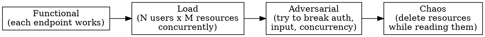

# Adversarial API Testing

Before designing attack cases, run `search_patterns("<api-area> security")` — foxhound surfaces known vulnerability patterns for the API's domain.

## The Escalation Principle

Passing functional tests means the happy path works. It says nothing about security boundaries, input sanitization, or concurrency. After functional tests pass clean, escalate through these layers until something breaks or you've exhausted the attack surface. Record stop decisions in a `.seeds/` issue: `[DEFERRED: layer_name — rationale]`.



Each layer finds bugs the previous layer can't:
- **Functional** catches wrong status codes, missing fields, bad serialization
- **Load** catches connection pool exhaustion, rate limiter gaps, cache stampedes
- **Adversarial** catches IDOR, injection, lost updates, forged tokens
- **Chaos** catches unhandled FK violations, race conditions between create/delete, orphaned state

The bugs that matter live one layer deeper than where you stopped.

`[eval: threat-model-produced]` Threat model identifies at least 3 attack categories with specific endpoints and expected status codes for the target API.

## Attack Categories

### 1. Authorization Boundary (IDOR)

The highest-value category. Most APIs verify "does the user have access to the resource type?" but not "does this specific resource belong to the scope in the URL?"

| Attack | What to test | Expected |
|--------|-------------|----------|
| Cross-parent access | `PATCH /parents/B/children/{childFromA}` | 404, not 200 |
| Cross-parent delete | `DELETE /parents/B/children/{childFromA}` | 404, not 204 |
| Scope escalation | Read-only token → write endpoint | 403 |

Financial/PII APIs warrant all 4 layers; MVP/internal tools can stop at Load.

| Disabled user | Valid API key, disabled account | 401 |
| Expired token | Past-expiry token or key | 401 |
| Missing auth | No header at all | 401 |
| Malformed auth | `Bearer invalid`, `Bearer `, empty | 401 |

**The IDOR pattern:** If GET checks `resource.parentId === url.parentId` but PATCH/DELETE don't, you have an IDOR. This is the most common variant — GET gets the check because developers think about "showing the right thing," but mutations skip it because they think about "does the user have permission to mutate?"

**How to test:** Create resource R on parent A. Try to access R via parent B's URL. If the API returns anything other than 404, that's a vulnerability.

`[eval: idor-tests-written]` At least one cross-parent access test exists that asserts 404 (not 200/204) when accessing a resource via a wrong parent URL.

### 2. Input Sanitization

What happens when the DB receives data the application layer didn't expect?

| Attack | Payload | PostgreSQL | MongoDB | SQLite |
|--------|---------|-----------|---------|--------|
| Null bytes | `\x00` in text | **500 crash** (rejects `\0` in text) | Stores silently | Stores silently |
| Deeply nested JSON | 1000 levels deep | Parse succeeds, may OOM | 100-level BSON limit | N/A |
| Huge payload | 1MB string field | Succeeds (no default limit) | 16MB BSON limit | Succeeds |
| Prototype pollution | `{"__proto__":{"admin":true}}` | Ignored (SQL) | **Dangerous** if using `Object.assign` | Ignored |
| SQL/NoSQL injection | `' OR 1=1 --` | Safe if parameterized | `{"$gt":""}` dangerous if not sanitized | Safe if parameterized |
| Unicode edge cases | Zalgo, RTL override, ZWJ | Stores fine | Stores fine | Stores fine |

**The null byte pattern (PostgreSQL):** PostgreSQL `text` and `jsonb` columns reject null bytes (`\0`) at the protocol level. If your API doesn't strip them before insert, the DB driver throws an unhandled exception → 500. Fix: sanitize at the API boundary, not deep in the service layer.

**Mitigation:** `stripNullBytes()` applied to `request.json()` output in every handler that writes to DB.

### 3. Concurrency

Single-request tests can't find these. You need N simultaneous requests to the same resource.

| Attack | Setup | What breaks |
|--------|-------|-------------|
| Lost update | 50 concurrent PATCHes | Last write wins silently; no conflict detection |
| Create-then-read | POST + immediate GET | Read returns 404 if replica lag |
| Update-vs-delete | PATCH + DELETE same resource | PATCH succeeds on deleted resource, or 500 from FK |
| Thundering herd | Invalidate cache + 100 concurrent reads | All 100 hit DB simultaneously |
| Double-submit | Same POST body twice simultaneously | Two resources created (no idempotency) |
| Pool exhaustion | 200 concurrent heavy queries | Connection timeout → 500 |

**The lost update pattern:** If PATCH doesn't use optimistic concurrency (`If-Match` / version check), concurrent updates silently overwrite each other. The fix is either: (a) require `If-Match` header, (b) use `UPDATE ... WHERE version = $expected`, or (c) accept last-write-wins as a design decision and document it.

### 4. Query Parameter Abuse

URL parameters parsed into SQL or used in logic without validation.

| Attack | Payload | Expected |
|--------|---------|----------|
| Negative limit | `?limit=-1` | Clamped to 1 or 400 |
| Huge limit | `?limit=999999999` | Clamped to max |
| NaN limit | `?limit=NaN` | Default applied |
| XSS in param | `?limit=<script>` | 400 or ignored |
| Forged cursor | `?cursor=garbage` | 200 with empty results or 400 |
| SQL in cursor | `?cursor=base64(' OR 1=1)` | Safe (parameterized) or 400 |
| Absurd bbox | `?bbox=NaN,NaN,NaN,NaN` | Empty results or 400 |
| Inverted bbox | `?bbox=180,90,-180,-90` | Empty results or 400 |

### 5. HTTP Protocol Abuse

| Attack | What to test | Expected |
|--------|-------------|----------|
| Wrong method | PUT/TRACE/CONNECT on GET-only endpoint | 405, not 500 |
| Enormous headers | 64KB+ custom header | 431 |
| Very long URL | 8KB+ URL | 414 or handled |
| 1000 query params | `?p0=v0&p1=v1&...` | Handled (ignored) |
| Wrong content-type | `application/xml` body to JSON endpoint | 415 or 422 |
| Slowloris | Stream request body, never close | Timeout, not hang forever |
| No content-type | POST with body but no Content-Type | 422 or handled |

### 6. Referential Integrity

| Attack | Setup | Expected |
|--------|-------|----------|
| Fake FK reference | Create child with non-existent parentId | 422, not 500 |
| Self-reference | Set resource's parentId to its own ID | 422 or handled |
| Circular reference | A→B→A parent chain | 422 or handled |
| Delete parent while reading children | Concurrent delete + list | 404 or empty, not 500 |
| Orphan creation | Create child, delete parent, read child | Consistent state |

### 7. Field Injection

| Attack | Payload | Expected |
|--------|---------|----------|
| Extra fields in PATCH | `{"content":"ok", "userId":"other-user", "id":"new-id"}` | Extra fields ignored |
| Type confusion | `{"count": "not-a-number"}` | 422 |
| Overwrite immutable | `{"createdAt": "2020-01-01"}` | Ignored |
| Overwrite computed | `{"version": 999}` | Ignored |

`bias:availability` — After drafting the attack plan, check: are you testing only familiar attack vectors (SQLi, XSS, IDOR) because they come to mind easily? Less obvious vectors often matter more: business logic flaws, serialization attacks, SSRF, cache poisoning, and domain-specific vectors. What would a specialist in this API's domain try?

`[eval: concurrency-races-tested, coverage-graded]`

## Coverage Expectations

After writing tests, grade coverage with eval-protocol. Minimum expectations for a thorough suite:

```
[expect: completeness] Every REST endpoint has at least one test
[expect: completeness] Both auth scopes tested with enforcement checks
[expect: depth]        At least 3 adversarial categories applied per write endpoint
[expect: resilience]   No 500s from any malformed input test
[expect: completeness] Pagination tested with cursor-following, not just ?limit=N
[expect: completeness] Cache behavior tested (ETag → 304, invalidation)
[expect: depth]        IDOR tested: resource accessed via wrong parent URL
[expect: depth]        Concurrent mutation tested: PATCH+DELETE on same resource

[on-fail] Check attack categories above for uncovered areas.
          Generate additional test cases targeting the gap.
          Re-run and re-grade.
```

Pass rate below 80% means significant attack surface is untested.

## Generating a Test Script

Don't use a generic test runner. Generate a project-specific script that:

1. **Sets up test data via direct DB** — batch SQL for users, resources, permissions
2. **Uses the language's native HTTP client** — `fetch()`, `requests`, `net/http`
3. **Manages its own concurrency** — worker pool, not a framework
4. **Reports per-endpoint** — status, p50/p95 latency, error breakdown
5. **Cleans up after itself** — delete test data in a finally block
6. **Is a single file** — no dependencies beyond the runtime

The script should be runnable with one command (`npx tsx script.ts`, `python script.py`) and produce a summary table at the end.

`[eval: test-script-runnable]` A single-file test script exists that can be executed with one command, sets up its own test data, and produces a per-endpoint summary table on stdout.
