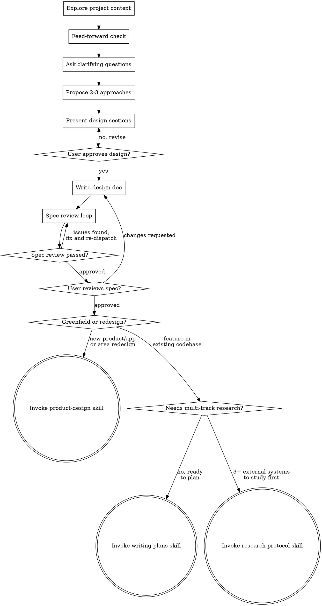

# Brainstorming Ideas Into Designs

Turn ideas into fully formed designs and specs through natural collaborative dialogue. Understand the project context, ask questions one at a time, present the design, get approval.

No implementation until the design is approved — not code, not scaffolding, not project setup. This applies even to "simple" projects, because simple projects are where unexamined assumptions cause the most wasted work. The design can be short (a few sentences for truly simple projects), but present it and get approval. If simplicity seems sufficient, document why in Locked Decisions.

## Checklist

Complete in order:

1. **Explore project context** — check files, docs, recent commits
2. **Feed-forward from prior retros** — search for prior retros relevant to this work; surface known failure modes as design constraints (see below). Skip gracefully if none exist.
3. **Flow Mapping (brownfield)** — identify the end-to-end flow the task participates in (see below). Skip for greenfield.
4. **Ask clarifying questions** — one at a time; understand purpose, constraints, success criteria
5. **Propose 2-3 approaches** — with trade-offs and your recommendation
6. **Present design** — in sections scaled to complexity, get approval after each section
7. **Write design doc** — save to `docs/superpowers/specs/YYYY-MM-DD-<topic>-design.md` and commit
8. **Spec review loop** — dispatch spec-document-reviewer subagent with review context (not session history); fix and re-dispatch until approved (max 3 iterations, then surface to human)
9. **User reviews written spec** — ask user to review before proceeding
10. **Transition to implementation** — route to writing-plans, product-design, or research-protocol

**Cycles 2+:** Skip context-gathering (carries from cycle 1). Start at design/decision steps.

## Process Flow



The terminal state is writing-plans, research-protocol, or product-design. No other implementation skill.

**Routing after design approval:**
- **Product-design** — greenfield ("build a new app/product") or complete area redesign. Signals: multiple sections/areas, no existing codebase to modify, user wants a design handoff. Eventually feeds into writing-plans.
- **Research-protocol** — requirements need studying 3+ external systems before planning. Signals: 3+ tracks of questions, answers require external sources, findings need cross-domain synthesis. Produces synthesis that feeds into writing-plans.
  `[eval: research-readiness]`
- **Writing-plans** — feature, bugfix, or change within an existing codebase. This is the default.

Brownfield routing: when brainstorming surfaces "this whole area needs rethinking" (product-level scope, not code-level), route to product-design in brownfield mode.

---

## The Process

### Feed-forward from prior retros

A brief rearview-mirror check before design exploration begins. This is feed-forward (prevent known failures), not feedback (react after).

1. Search for retros relevant to the work domain: `ml search '<domain> retro'` and `ml search 'spec retro'`
2. From any results, extract feed-forward items — the "what went wrong that could go wrong again" from prior cycles
3. Surface these as known failure modes to hold against the design. Examples: "prior specs in this area missed adapter contracts", "type scope was underspecified last time", "integration points were assumed stable but weren't"
4. If no prior retros exist (first cycle for this domain), skip and proceed

Feed-forward items carry into the design as additional constraints during approach exploration and as review criteria during the spec review loop.

### Understanding the idea

- Check current project state first (files, docs, recent commits)
- If `docs/architecture/_meta.json` exists and `overview.md` is fresh, load it as pre-gathered context. If `subsystems.md` exists, use subsystem boundaries to scope questions.
- Before asking detailed questions, assess scope: if the request describes multiple independent subsystems ("build a platform with chat, file storage, billing, and analytics"), flag this immediately. Don't refine details of a project that needs decomposition first.
- For multi-subsystem projects, help decompose into sub-projects: what are the independent pieces, how do they relate, what order to build? Then brainstorm the first sub-project. Each gets its own spec → plan → implementation cycle.
- For appropriately-scoped projects, ask questions one at a time
- Prefer multiple choice when possible, open-ended is fine too
- One question per message — break complex topics into multiple questions
- Focus on: purpose, constraints, success criteria

### Exploring approaches

Before going deep, find 3+ candidates from different domains. Check existing indexed sources, mulch, and codebase for prior art — the problem may already be solved.
`[eval: breadth]` `[eval: scavenge]`

- Use `search_packages` → `get_docs` for libraries being considered — verify patterns and version compatibility
- If `.mulch/` exists, `mulch search "<topic>"` for prior decisions and conventions
- Search dependencies and codebase for existing solutions before proposing new abstractions
- Propose 2-3 approaches with trade-offs. Lead with your recommendation and reasoning.
- Before proposing architecture for an underrepresented domain: has a reference implementation been studied? If no domain codebook exists, pattern-extraction-pipeline on a well-architected project produces better designs than reasoning from first principles. When competing design forces surface (sync vs latency, undo vs collaboration), load the relevant domain-codebook.

**Codebook gap**: If no codebook or reference exists for a domain with competing forces: `~/.claude/scripts/codebook-gap.sh record "Force: X vs Y vs Z" "Leads: [repos/files seen]. Context: [what you were doing]"`

### Surfacing open questions

As you explore approaches, track what you don't know yet — assumptions unverified, APIs unchecked, behaviors guessed at. Surface per design section. They carry forward into the spec as "Open Questions" and into the plan's Open Questions section. Every question must be concrete and answerable (not "is this good?" but "does X return Y?"). Nested sub-questions fine when a question branches.
`[eval: open-questions-surfaced]`

### Presenting the design

For visual/frontend work, load `frontend-design/references/visual-design-thinking.md` for design-quality principles. Use the Multi-Direction Exploration pattern: propose 2-3 distinct visual directions with concrete tokens instead of converging early.

Once you believe you understand what you're building, present the design:
- Scale each section to its complexity: a few sentences if straightforward, up to 200-300 words if nuanced
- Ask after each section whether it looks right so far
- Cover: architecture, components, data flow, error handling, testing
- Go back and clarify when something doesn't make sense

`[eval: feasibility]` Design uses available tools/APIs, not assumed ones.

### Design for isolation and clarity

- Break the system into units with one clear purpose, well-defined interfaces, testable independently
- For each unit: what does it do, how do you use it, what does it depend on?
- Can someone understand a unit without reading internals? Can you change internals without breaking consumers? If not, boundaries need work.
- Smaller, focused files — you reason better about code you can hold in context at once

### Working in existing codebases (flow-first)

Every brownfield task is a flow task. Before scoping to a component, identify the end-to-end flow from observable trigger to observable outcome. The component is the change site; the flow is the task. Explore existing structure in terms of flow position: what's upstream, what's downstream, what contracts exist.

Where existing code has problems affecting the work, include targeted improvements in the design. Don't propose unrelated refactoring.

---

## Flow Mapping (Brownfield)

Mandatory for all brownfield work. Runs after context exploration, before clarifying questions. Skip for greenfield.

### Steps

1. **Check architecture docs.** If `docs/architecture/_meta.json` exists and `overview.md` is fresh, load it. If `subsystems.md` exists, load boundaries.
2. **Identify the flow.** "What end-to-end flow does this task participate in?" Trace from trigger to outcome using architecture docs. If multiple flows, identify all and mark the primary.
3. **Calibrate depth:**
   - Task entered through brainstorming + ≤2 subsystems → **Standard**: produce flow map from architecture docs
   - Task crosses 3+ subsystems → **Deep**: invoke codebase-diagnostics at L4+L6+L7 minimum
   - Architecture docs absent/stale → **Deep** (must map first)
   `[eval: tier-calibration]`
4. **Mark the change site** with `[CHANGE SITE]`. Note behavioral stubs — functions that return constants, ignore parameters, silently swallow errors, or delegate to other stubs. Mark with `[STUB]`. A stub adjacent to the change path shifts scope: "modify behavior" may mean "implement behavior."
5. **State upstream/downstream contracts.** What does the change site receive? What does it produce? If upstream/downstream nodes are stubs, note that the contract exists in types but not behavior.
6. **Emit the flow map** as `## Flow Map` section in the design doc.

### Flow map format (Standard tier)

````markdown
## Flow Map

**Flow:** <user action> → <system outcome>
**Observable trigger:** <specific API call or user action>
**Observable outcome:** <what the user/caller sees>

### Path
1. `path/to/file.ts` — <what this node does>
2. `path/to/other.ts` — **[CHANGE SITE]** <what this node does>
3. `path/to/next.ts` — <what this node does> (or **[STUB]** <what it claims to do>)

### Upstream contract
- <what the change site receives>

### Downstream contract
- <what the change site produces>

### Depth justification
<which tier and why>
````

With the flow map established, clarifying questions shift from component-scoped to flow-scoped ("should the flow outcome change, or only internal behavior while contracts stay the same?"), approach proposals state which contracts each preserves/changes, and design sections reference flow position.

`[eval: flow-map-present]`

---

## After the Design

### Write the spec

Save to `docs/superpowers/specs/YYYY-MM-DD-<topic>-design.md` (user preferences override). Commit to git.

The design doc must include:

**Locked Decisions** — Concrete choices that downstream planning must honor. Each entry: what was decided, what it rules out. Example: "Infinite scroll decided — rules out pagination, affects data fetching pattern."

**Referenced Documents** — Docs the user mentioned during discussion, with full relative paths so downstream agents can read them directly.

| Section | Content |
|---------|---------|
| **Intent** | What does the user actually want? |
| **Constraints** | What's fixed? (tech stack, timeline, existing code) |
| **Locked Decisions** | What's decided and shouldn't be revisited? |
| **Open Questions** | Blocking: ___ / Exploratory: ___ |
| **Approaches** | Considered: ___ / Chosen: ___ / Rationale: ___ |

`[eval: shape]` Design doc has Locked Decisions with ≥1 concrete, falsifiable constraint.
`[eval: completeness]` Every referenced doc appears with a path.

### Record decisions in mulch

After writing the spec and before the review loop, record each Locked Decision:

```bash
ml record <domain> --type decision \
  --title "<the decision>" \
  --rationale "<why this was chosen>" \
  --classification foundational \
  --tags "scope:<module>,assumption:<name>,source:brainstorming,spec:<spec-path>,deferred:none,lifecycle:active,<situation-tags>" \
  --evidence-file "<spec-path>"
```

Check `ml search "scope:<module>"` first. Use `--supersedes` for updates. If the review loop modifies locked decisions, re-record with `--supersedes`.

`[eval: provenance]` `[eval: scope-tagged]` `[eval: assumptions-explicit]`

### Spec review loop

`[eval: criteria-precommit]` Before dispatching review, write down what "Approved" means.

1. Dispatch spec-document-reviewer subagent (see `spec-document-reviewer-prompt.md`)
2. If issues: fix, re-dispatch until approved
3. If loop exceeds 3 iterations, surface to human

### User review gate

> "Spec written and committed to `<path>`. Please review and let me know if you want changes before we start the implementation plan."

Wait for response. Changes requested → update and re-run review loop. Approved → proceed.

After approval, verify you answered the user's actual question, not a simpler one (`bias:substitution`). If a strategic brief exists at `product/strategy/briefs/`, load it as Locked Decision context.

---

## Questioning Techniques

Consult `~/.claude/skills/eval-protocol/references/questioning-techniques.md` for intent exploration. Use the context checklist (what, why, who, done) as background — weave gaps into natural conversation, never switch to checklist mode.

Before probing gray areas, classify the work domain:
- **Visual features** → layout, density, interactions, empty states
- **APIs/CLIs** → response format, flags, error handling, verbosity. APIs: design for testability (stateless auth, machine-readable error envelope, configurable rate limits, deterministic cache invalidation)
- **Content systems** → structure, tone, depth, flow
- **Organization tasks** → grouping, naming, duplicates, exceptions
- **Data pipelines** → input format, error tolerance, idempotency, output schema
- **Infrastructure** → rollback strategy, monitoring, capacity, failure modes

Probe only relevant categories.

`[eval: context]` Questions matched the work domain.
`[eval: depth]` Asked ≥1 follow-up that made a vague term concrete.

## Key Principles

- **One question at a time** — don't overwhelm
- **Multiple choice preferred** — easier to answer when possible
- **YAGNI ruthlessly** — remove unnecessary features
- **Explore alternatives** — always 2-3 approaches before settling
- **Incremental validation** — present, approve, move on
- **Be flexible** — go back when something doesn't make sense
