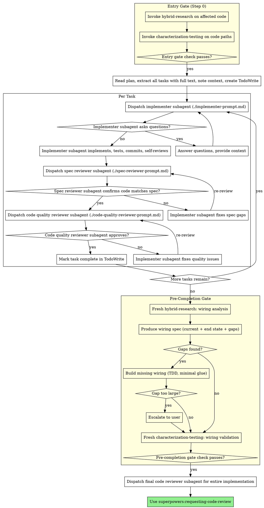

# Subagent Mode Process Diagram

```dot
digraph process {
    rankdir=TB;

    subgraph cluster_entry_gate {
        label="Entry Gate (Step 0)";
        style=filled; fillcolor=lightyellow;
        "Invoke hybrid-research on affected code" [shape=box];
        "Invoke characterization-testing on code paths" [shape=box];
        "Entry gate check passes?" [shape=diamond];
        "Invoke hybrid-research on affected code" -> "Invoke characterization-testing on code paths";
        "Invoke characterization-testing on code paths" -> "Entry gate check passes?";
    }

    subgraph cluster_per_task {
        label="Per Task";
        "Dispatch implementer subagent (./implementer-prompt.md)" [shape=box];
        "Implementer subagent asks questions?" [shape=diamond];
        "Answer questions, provide context" [shape=box];
        "Implementer subagent implements, tests, commits, self-reviews" [shape=box];
        "Dispatch spec reviewer subagent (./spec-reviewer-prompt.md)" [shape=box];
        "Spec reviewer subagent confirms code matches spec?" [shape=diamond];
        "Implementer subagent fixes spec gaps" [shape=box];
        "Dispatch code quality reviewer subagent (./code-quality-reviewer-prompt.md)" [shape=box];
        "Code quality reviewer subagent approves?" [shape=diamond];
        "Implementer subagent fixes quality issues" [shape=box];
        "Mark task complete in TodoWrite" [shape=box];
    }

    subgraph cluster_pre_completion_gate {
        label="Pre-Completion Gate";
        style=filled; fillcolor=lightyellow;
        "Fresh hybrid-research: wiring analysis" [shape=box];
        "Produce wiring spec (current + end state + gaps)" [shape=box];
        "Gaps found?" [shape=diamond];
        "Build missing wiring (TDD, minimal glue)" [shape=box];
        "Gap too large?" [shape=diamond];
        "Escalate to user" [shape=box];
        "Fresh characterization-testing: wiring validation" [shape=box];
        "Pre-completion gate check passes?" [shape=diamond];
        "Fresh hybrid-research: wiring analysis" -> "Produce wiring spec (current + end state + gaps)";
        "Produce wiring spec (current + end state + gaps)" -> "Gaps found?";
        "Gaps found?" -> "Build missing wiring (TDD, minimal glue)" [label="yes"];
        "Gaps found?" -> "Fresh characterization-testing: wiring validation" [label="no"];
        "Build missing wiring (TDD, minimal glue)" -> "Gap too large?";
        "Gap too large?" -> "Escalate to user" [label="yes"];
        "Gap too large?" -> "Fresh characterization-testing: wiring validation" [label="no"];
        "Escalate to user" -> "Fresh characterization-testing: wiring validation";
        "Fresh characterization-testing: wiring validation" -> "Pre-completion gate check passes?";
    }

    "Read plan, extract all tasks with full text, note context, create TodoWrite" [shape=box];
    "More tasks remain?" [shape=diamond];
    "Dispatch final code reviewer subagent for entire implementation" [shape=box];
    "Use superpowers:requesting-code-review" [shape=box style=filled fillcolor=lightgreen];

    "Entry gate check passes?" -> "Read plan, extract all tasks with full text, note context, create TodoWrite" [label="yes"];
    "Read plan, extract all tasks with full text, note context, create TodoWrite" -> "Dispatch implementer subagent (./implementer-prompt.md)";
    "Dispatch implementer subagent (./implementer-prompt.md)" -> "Implementer subagent asks questions?";
    "Implementer subagent asks questions?" -> "Answer questions, provide context" [label="yes"];
    "Answer questions, provide context" -> "Dispatch implementer subagent (./implementer-prompt.md)";
    "Implementer subagent asks questions?" -> "Implementer subagent implements, tests, commits, self-reviews" [label="no"];
    "Implementer subagent implements, tests, commits, self-reviews" -> "Dispatch spec reviewer subagent (./spec-reviewer-prompt.md)";
    "Dispatch spec reviewer subagent (./spec-reviewer-prompt.md)" -> "Spec reviewer subagent confirms code matches spec?";
    "Spec reviewer subagent confirms code matches spec?" -> "Implementer subagent fixes spec gaps" [label="no"];
    "Implementer subagent fixes spec gaps" -> "Dispatch spec reviewer subagent (./spec-reviewer-prompt.md)" [label="re-review"];
    "Spec reviewer subagent confirms code matches spec?" -> "Dispatch code quality reviewer subagent (./code-quality-reviewer-prompt.md)" [label="yes"];
    "Dispatch code quality reviewer subagent (./code-quality-reviewer-prompt.md)" -> "Code quality reviewer subagent approves?";
    "Code quality reviewer subagent approves?" -> "Implementer subagent fixes quality issues" [label="no"];
    "Implementer subagent fixes quality issues" -> "Dispatch code quality reviewer subagent (./code-quality-reviewer-prompt.md)" [label="re-review"];
    "Code quality reviewer subagent approves?" -> "Mark task complete in TodoWrite" [label="yes"];
    "Mark task complete in TodoWrite" -> "More tasks remain?";
    "More tasks remain?" -> "Dispatch implementer subagent (./implementer-prompt.md)" [label="yes"];
    "More tasks remain?" -> "Fresh hybrid-research: wiring analysis" [label="no"];
    "Pre-completion gate check passes?" -> "Dispatch final code reviewer subagent for entire implementation" [label="yes"];
    "Dispatch final code reviewer subagent for entire implementation" -> "Use superpowers:requesting-code-review";
}
```
