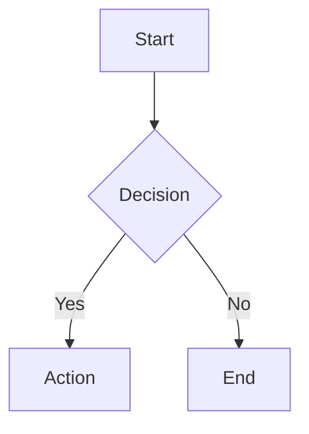

# Obsidian Markdown & Formatting Reference

## Obsidian Flavored Markdown (OFM)

Extensions beyond CommonMark/GFM that are unique to Obsidian.

### Internal Links & Embeds

```markdown
[[Page Name]]                    # Link to page
[[Page Name|Display Text]]       # Link with alias
[[Page Name#Heading]]            # Link to heading
[[Page Name#^block-id]]          # Link to block

![[Page Name]]                   # Embed entire page
![[Page Name#Heading]]           # Embed heading section
![[Page Name#^block-id]]         # Embed specific block
![[image.png]]                   # Embed image
![[image.png|300]]               # Embed image with width
![[image.png|300x200]]           # Embed image with width x height
![[audio.mp3]]                   # Embed audio player
![[video.mp4]]                   # Embed video player
![[file.pdf]]                    # Embed PDF
![[file.pdf#page=3]]             # Embed PDF at page
```

### Block Identifiers

Any block (paragraph, list item, table, etc.) can be referenced by appending `^id`:

```markdown
This is a paragraph. ^my-block-id
```

- IDs: alphanumeric + dashes only. No spaces.
- Referenced via `[[Page#^my-block-id]]` or `![[Page#^my-block-id]]`.
- Obsidian auto-generates IDs when you type `[[^^` and search for blocks.

### Comments

```markdown
%%This text is hidden in reading view and PDF exports%%

%%
Multi-line comments
are also supported
%%
```

### Highlights

```markdown
==highlighted text==
```

### Footnotes

```markdown
This has a footnote[^1] and another[^note].

[^1]: Footnote content.
[^note]: Named footnotes work too.
    Indented lines continue the footnote.
```

### Critical Rule: HTML Blocks

**Markdown is NOT rendered inside HTML elements.** This is a CommonMark rule Obsidian follows strictly.

```markdown
<!-- This will NOT render bold: -->
<div>
**not bold**
</div>

<!-- Workaround: use HTML formatting inside HTML blocks -->
<div>
<strong>bold</strong>
</div>
```

---

## Callouts

Syntax: `> [!type]` on the first line of a blockquote.

### All 13 Types + Aliases

| Type         | Aliases                  |
| ------------ | ------------------------ |
| `note`       | _(default)_              |
| `abstract`   | `summary`, `tldr`        |
| `info`       | _(none)_                 |
| `todo`       | _(none)_                 |
| `tip`        | `hint`, `important`      |
| `success`    | `check`, `done`          |
| `question`   | `help`, `faq`            |
| `warning`    | `caution`, `attention`   |
| `failure`    | `fail`, `missing`        |
| `danger`     | `error`                  |
| `bug`        | _(none)_                 |
| `example`    | _(none)_                 |
| `quote`      | `cite`                   |

### Callout Syntax

```markdown
> [!tip] Custom title here
> Body content with **markdown** support.

> [!warning]- Collapsed by default
> This content is hidden until expanded.

> [!info]+ Expanded but foldable
> This content is visible but can be collapsed.

> [!note] Title-only callout, no body

> [!example] Nested callouts
> Content here.
> > [!tip] Inner callout
> > Nested content.
```

- **Foldable**: append `+` (expanded) or `-` (collapsed) after the type.
- **Custom title**: text after the type/fold marker on the same line.
- **Title-only**: omit all subsequent `>` lines (or leave them empty).
- **Nestable**: add additional `>` levels.

### Custom Callout CSS

```css
.callout[data-callout="custom-type"] {
    --callout-color: 50, 150, 255;    /* RGB values, no # */
    --callout-icon: lucide-rocket;     /* Any Lucide icon name */
}
```

---

## Advanced Formatting

### Tables

```markdown
| Left     | Center   | Right    |
| :------- | :------: | -------: |
| aligned  | aligned  | aligned  |
```

- Minimum 3 dashes per column.
- Colon placement controls alignment: `:--` left, `:--:` center, `--:` right.
- Obsidian supports `[[links]]` and other OFM inside table cells.

### Math (MathJax)

```markdown
Inline: $e^{i\pi} + 1 = 0$

Block:
$$
\int_0^\infty e^{-x^2} dx = \frac{\sqrt{\pi}}{2}
$$
```

- Uses MathJax with LaTeX syntax.
- Block math must have `$$` on its own lines.
- Dollar signs in non-math context: escape with `\$`.

### Mermaid Diagrams

````markdown

````

Supported diagram types: flowchart, sequence, gantt, class, state, pie, ER, journey, git graph, mindmap, timeline, quadrant, sankey, xy-chart.

### Task Lists

```markdown
- [ ] Unchecked task
- [x] Completed task
- [ ] Tasks support **formatting** and [[links]]
```

- Clicking the checkbox in reading view toggles it in the source.
- Dataview and Tasks plugins can query task status.

### Strikethrough

```markdown
~~strikethrough text~~
```

### Code Blocks

````markdown
Inline: `code`

Fenced with syntax highlighting:
```python
def hello():
    print("Hello, world!")
```
````

- Language identifier after opening fence enables syntax highlighting.
- Obsidian uses Prism.js; supports most common languages.
- Nested code fences: use more backticks on the outer fence than the inner.
