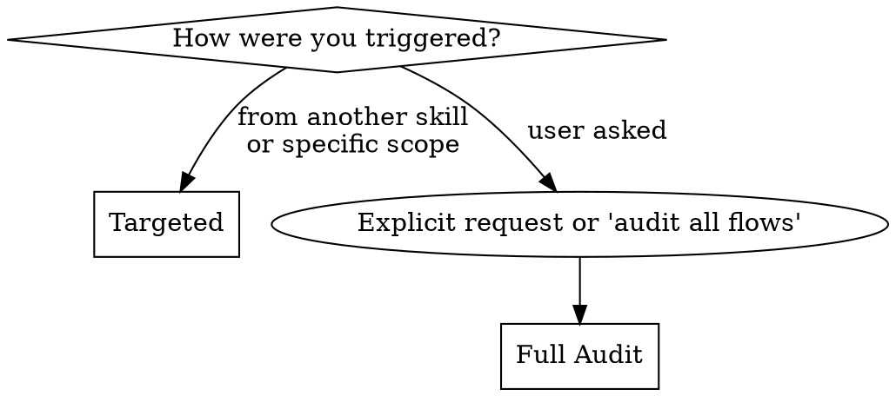

# Shadow Walk

Trace user-facing flows through code to find UX issues. Report what the user experiences — never fix.

## Mode Selection



**Full audit:** Wave 1 (major route groups) -> Wave 2 (sub-flows where Wave 1 found 3+ issues) -> Wave 3 (deep dives on multi-mode features). Dispatch one subagent per scope.

**Targeted:** Single scope from the table below. Use when triggered by another skill or when user specifies a narrow scope.

| Scope Type | What Gets Walked | Typical Trigger |
|---|---|---|
| Single file | All handlers/interactions in file | Anti-pattern risk score, systematic-debugging |
| Single flow | Entry to completion, every branch | Brainstorming, user request |
| Signal cluster | Every file:line of a signal type -> user impact | Characterization-testing |
| Component boundary | Data flow across boundary, state handoff, error propagation | Executing-plans, writing-plans |
| Regression | Re-walk flows touching changed files, compare findings | Requesting-code-review |

## Phases

Every walk executes all 5 phases in order — skipping phases loses the clustering and routing that make findings actionable. For targeted single-flow walks, Phases 4-5 are lightweight (no clustering needed with one flow, but still produce routing recommendations).

### Phase 1: Target

1. Foxhound `search` for the flow area — surfaces UX patterns and known issues before you walk the code
2. Load anti-pattern report from `<project>/.claude/anti-pattern-report.txt` if it exists
3. If `.seeds/` exists: `sd list --label "ux-gap"` — check for existing UX gap issues to avoid duplicates and to re-verify prior findings
4. For full audit: rank route groups by risk score, assign Wave 1 agents
5. For targeted: validate scope, identify files to walk
6. Output: walk plan (scopes + priority order)

### Phase 2: Walk

Dispatch subagents using `references/agent-prompt.md` template. Each agent loads `references/walk-protocol.md`.

For full audit, dispatch agents in parallel (one per route group). For targeted, single agent or sequential.

### Phase 3: Compile

**Flows 2+:** Delta-only checklist — what differs from flow 1.

1. Merge findings across agents, deduplicate by file:line
2. Cross-reference with `references/false-positives.md` — remove known false positives
3. Classify severity: **critical** (blocks user), **major** (confusing), **minor** (rough edge)
   Decision tree: Visible to user? No→skip. Blocking task? Yes→critical. Causes confusion? Yes→major. Rough edge? Yes→minor. Otherwise→skip.
3a. Cross-reference findings with userinterface-wiki rules and domain-codebook force clusters:

| Finding Pattern | Rule / Codebook |
|---|---|
| Hit target too small, hard to click | Rule: `ux-fitts-target-size`, `ux-fitts-hit-area` |
| No feedback after action | Rule: `ux-doherty-under-400ms`, `ux-doherty-perceived-speed` |
| Too many choices, overwhelming | Rule: `ux-hicks-minimize-choices`, `ux-progressive-disclosure` |
| Animation too slow/fast/janky | Rule: `timing-under-300ms`, `timing-consistent`, `spring-for-gestures` |
| Abrupt disappearance, no exit animation | Rule: `exit-requires-wrapper`, `exit-prop-required` |
| Focus lost, keyboard nav breaks | Codebook: `focus-management-across-boundaries` |
| Gesture conflict, drag fights scroll | Codebook: `gesture-disambiguation` |
| Scroll jank, large list performance | Codebook: `virtualization-vs-interaction-fidelity` |

Findings that map to a rule get a **Rule:** column in the output table.
Findings that map to a force cluster get a **Codebook:** column — signaling
the fix needs architectural guidance, not just a rule application.

4. Format per STATE.md structure

### Phase 4: Cluster

1. Group by flag type, file, and flow
2. Cross-reference with anti-pattern scan: scan-predicted vs UX-only findings
3. Identify hotspots (3+ findings)
4. For full audit: decide Wave 2/3 escalation

### Phase 5: Route

Recommend next actions per flag pattern:

| Flag Pattern | Route To | Priority |
|---|---|---|
| SILENT FAIL, RACE | characterization-testing | High |
| DEAD END, NO FEEDBACK | brainstorming | Medium |
| HIDDEN REQ | writing-plans | Medium |
| NAV TRAP | systematic-debugging | Medium |
| ASSUMPTION | documentation | Low |

**Seeds produce**: If `.seeds/` exists, after routing: `sd create` for each major/critical finding not already tracked (check Phase 1 dedup). Label with `ux-gap` and the flag type. `sd update` existing issues with new evidence if re-verified.

## Output Format

Write findings to STATE.md (full audit) or return to calling skill (targeted). Each finding must have:

```
| # | Flag | Severity | File:Line | Flow | Description | Rule/Codebook | Catchable? |
```

**Catchable?** = Can a test or lint rule prevent this permanently? If yes, note how.

`[eval: state-coverage]` `[eval: rule-mapping]` `[eval: fix-routing]`
