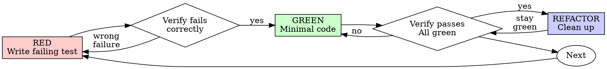

# Test-Driven Development

Write the test first. Watch it fail. Write minimal code to pass. If you didn't watch the test fail, you don't know if it tests the right thing.

## When to Use

New features, bug fixes, refactoring, behavior changes — always. Exceptions only with your human partner's permission: throwaway prototypes, generated code, configuration files.

## Red-Green-Refactor



### RED — Write Failing Test

Write one minimal test showing what should happen. One behavior, clear name, real code (no mocks unless unavoidable). For property-based invariants (roundtrip, algebraic, preservation, idempotence) derived from type signatures, load `characterization-testing/references/property-based-characterization.md`.

<Good>
```typescript
test('retries failed operations 3 times', async () => {
  let attempts = 0;
  const operation = () => {
    attempts++;
    if (attempts < 3) throw new Error('fail');
    return 'success';
  };

  const result = await retryOperation(operation);

  expect(result).toBe('success');
  expect(attempts).toBe(3);
});
```
Clear name, tests real behavior, one thing
</Good>

<Bad>
```typescript
test('retry works', async () => {
  const mock = jest.fn()
    .mockRejectedValueOnce(new Error())
    .mockRejectedValueOnce(new Error())
    .mockResolvedValueOnce('success');
  await retryOperation(mock);
  expect(mock).toHaveBeenCalledTimes(3);
});
```
Vague name, tests mock not code
</Bad>

### Multiple Test Cases — Capture All, Cycle One

When you can see multiple test cases, write them all but mark everything except the first failing test as skip. Every framework has a mechanism:

| Framework | Skip syntax |
|-----------|------------|
| Vitest/Jest/Mocha | `it.skip('...')` or `xit('...')` |
| pytest | `@pytest.mark.skip(reason="...")` |
| Go | `t.Skip("...")` at the top |
| RSpec | `xit` or `pending` |
| JUnit | `@Disabled` |

```typescript
it('adds warning when deps are stale', async () => { /* ... */ });

it.skip('no warning when deps hash is current', async () => { /* ... */ });
it.skip('no warning on first sync (no hash file)', async () => { /* ... */ });
```

Why: "hold one thought, drop the other" has a cognitive cost. Skipping gives extra thoughts somewhere to go without breaking discipline. Unskip one at a time — each gets its own RED-GREEN pass.

**Watch for negative assertions.** Tests asserting absence (`expect(x).toBeUndefined()`, `assert result is None`) often pass before the feature exists — the absence of the feature looks like the absence of the behavior. Skip these and unskip only after the positive case is GREEN.
`[eval: skip-discipline]`

### Verify RED — Watch It Fail

Run the test. Confirm it fails (not errors), the failure message is expected, and it fails because the feature is missing (not typos).

Test passes? You're testing existing behavior — fix the test, or if it's a negative assertion that can't fail yet, skip it. Test errors? Fix the error, re-run until it fails correctly.

### GREEN — Minimal Code

Write the simplest code to pass the test. Don't add features, refactor other code, or "improve" beyond the test.

<Good>
```typescript
async function retryOperation<T>(fn: () => Promise<T>): Promise<T> {
  for (let i = 0; i < 3; i++) {
    try {
      return await fn();
    } catch (e) {
      if (i === 2) throw e;
    }
  }
  throw new Error('unreachable');
}
```
Just enough to pass
</Good>

<Bad>
```typescript
async function retryOperation<T>(
  fn: () => Promise<T>,
  options?: {
    maxRetries?: number;
    backoff?: 'linear' | 'exponential';
    onRetry?: (attempt: number) => void;
  }
): Promise<T> {
  // YAGNI
}
```
Over-engineered
</Bad>

### Verify GREEN — Watch It Pass

Run the test. Confirm it passes, other tests still pass, output is pristine. Test fails? Fix code, not test. Other tests fail? Fix now.

### REFACTOR — Clean Up

After green only: remove duplication, improve names, extract helpers, run `/simplify`. Keep tests green. Don't add behavior.

### When Tests Fail After Refactoring

The question: is the test wrong, or is the code wrong?

```
Test fails after refactor
  → Did you intentionally change the behavior?
    YES → Update test expectations to match new behavior
    NO  → Your refactor broke something. Fix the code, not the test.
  → Is the test asserting implementation details (mock internals, private state)?
    YES → Refactor test to assert behavior. Keep the behavioral assertion.
    NO  → The test is correct. The failure is real.
```

Never weaken a test to make it pass — removing assertions, widening tolerances, or switching to `.toBeTruthy()` is hiding, not fixing. Run fixed tests multiple times to catch flakiness.
`[eval: test-integrity]`

### Repeat

Next failing test. If you have skipped tests, unskip the next one and start a new RED-GREEN cycle.

---

## Red Team Escalation

After happy-path TDD is green, switch from "does it work?" to "how does it break?" Each level is its own RED-GREEN cycle. Stop when a level doesn't apply.

Red team tests don't just verify robustness — they force defensive architecture. A scale test that times out at 10k items drives you to implement streaming. A concurrency test that creates duplicates drives idempotency keys. The test is the design pressure.

| Level | Attack surface | What it forces | Applies to |
|-------|---------------|----------------|------------|
| **1. Boundary** | 0, 1, -1, MAX, empty, off-by-one | Guard clauses, explicit limits | Everything |
| **2. Malformed** | Wrong types, missing fields, null, Unicode | Runtime validation, defensive parsing | Validation, parsing, untrusted input |
| **3. Concurrent** | Double-submit, stale data, mid-operation interruption | Idempotency, locking, queues | Stateful services |
| **4. Hostile + Scale** | Injection, path traversal, oversized payloads, 10x/100x volume | Sanitization, pagination, streaming | User-facing endpoints |

Work levels in order — boundary bugs are more common than injection bugs.

### Scale Tests Drive Architecture

```typescript
test('processes 10k features within 5s budget', async () => {
  const features = generateFeatures(10_000);
  const start = performance.now();
  const result = await processFeatures(features);

  expect(result.count).toBe(10_000);
  expect(performance.now() - start).toBeLessThan(5_000);
});
```

This test failing at 10k is what drives batch processing or streaming — not a style guide or code review comment. The test makes the architecture decision for you.

If a red team test passes immediately, either your implementation is already robust (document why in the test name) or the test doesn't exercise the attack vector (fix it). Each red team test should drive a specific implementation change — if it didn't, it's coverage theater.

---

## Example: Bug Fix

**Bug:** Empty email accepted

**RED:**
```typescript
test('rejects empty email', async () => {
  const result = await submitForm({ email: '' });
  expect(result.error).toBe('Email required');
});
```

**Verify RED:** `npm test` → FAIL: expected 'Email required', got undefined ✓

**GREEN:**
```typescript
function submitForm(data: FormData) {
  if (!data.email?.trim()) {
    return { error: 'Email required' };
  }
  // ...
}
```

**Verify GREEN:** `npm test` → PASS ✓

**REFACTOR:** Extract validation for multiple fields if needed.

---

## Good Tests

| Quality | Good | Bad |
|---------|------|-----|
| **Minimal** | One thing. "and" in name? Split it. | `test('validates email and domain and whitespace')` |
| **Clear** | Name describes behavior | `test('test1')` |
| **Shows intent** | Demonstrates desired API | Obscures what code should do |

## When Stuck

| Problem | Solution |
|---------|----------|
| Don't know how to test | Write wished-for API. Write assertion first. Ask your human partner. |
| Test too complicated | Design too complicated. Simplify interface. |
| Must mock everything | Code too coupled. Use dependency injection. |
| Test setup huge | Extract helpers. Still complex? Simplify design. |
| Unsure of test framework API | `search_packages` → `get_docs` for the testing library's current docs. |

When adding mocks or test utilities, read @testing-anti-patterns.md to avoid testing mock behavior instead of real behavior.

## The Discipline

Tests written after code pass immediately. Passing immediately proves nothing — you never saw the test catch the bug, so you don't know if it tests the right thing. Tests-first force edge case discovery before implementing. Tests-after verify you remembered everything (you didn't).

If you wrote production code before the test: delete it, start over with TDD. Don't keep it as "reference," don't "adapt" it while writing tests. The cost of keeping unverified code always exceeds the cost of rewriting under TDD.

Already-written code without tests: `[PENDING: TDD-retrofit]` — write characterization tests for existing behavior first, then refactor under TDD.

## Dependency Change Mock Audit

When adding a new dependency to an existing function (new subprocess call, new helper, new I/O), existing tests will pass locally but fail in CI where those binaries/files don't exist. This is the #1 cause of CI-only test failures.

**When you modify a function's dependencies:**
1. `Grep` for the function name in `tests/` directories
2. For each test: add mocks for the new dependency
3. Run with `--tb=short` to catch unmocked calls fast

## Verification Checklist

Before marking work complete:

- [ ] Every new function/method has a test
- [ ] Watched each test fail before implementing
- [ ] Wrote minimal code to pass each test
- [ ] All tests pass, output pristine
- [ ] No skipped tests left behind — all were unskipped and cycled
- [ ] Red team ladder applied to appropriate level

**Cycles 2+:** [✓ test failed] [✓ all pass] [✓ clean]. Full checklist only if previous cycle had issues.
